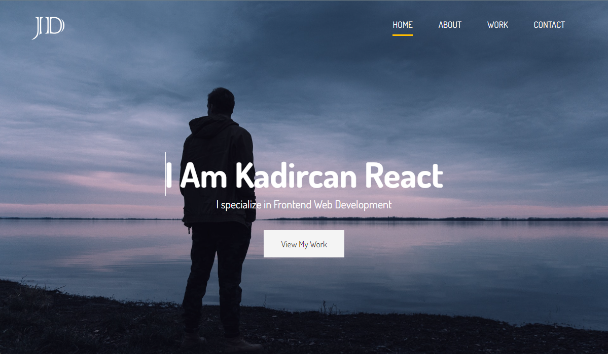
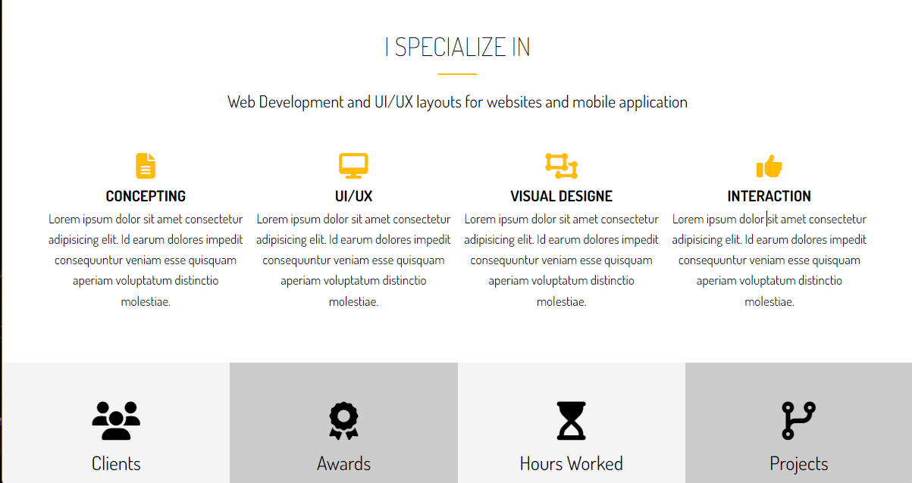
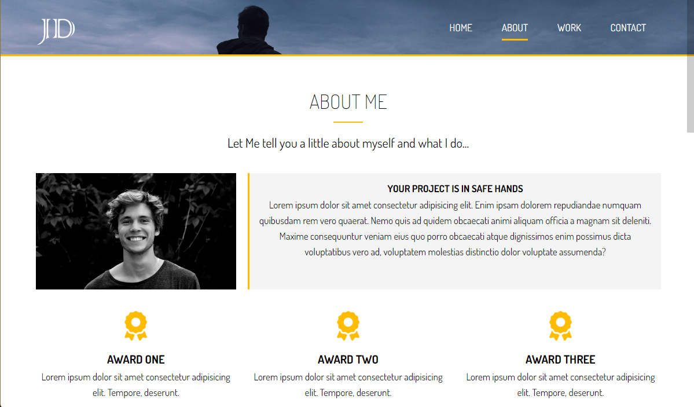
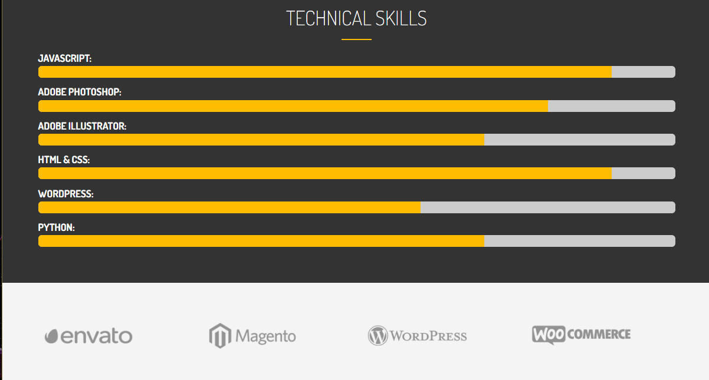
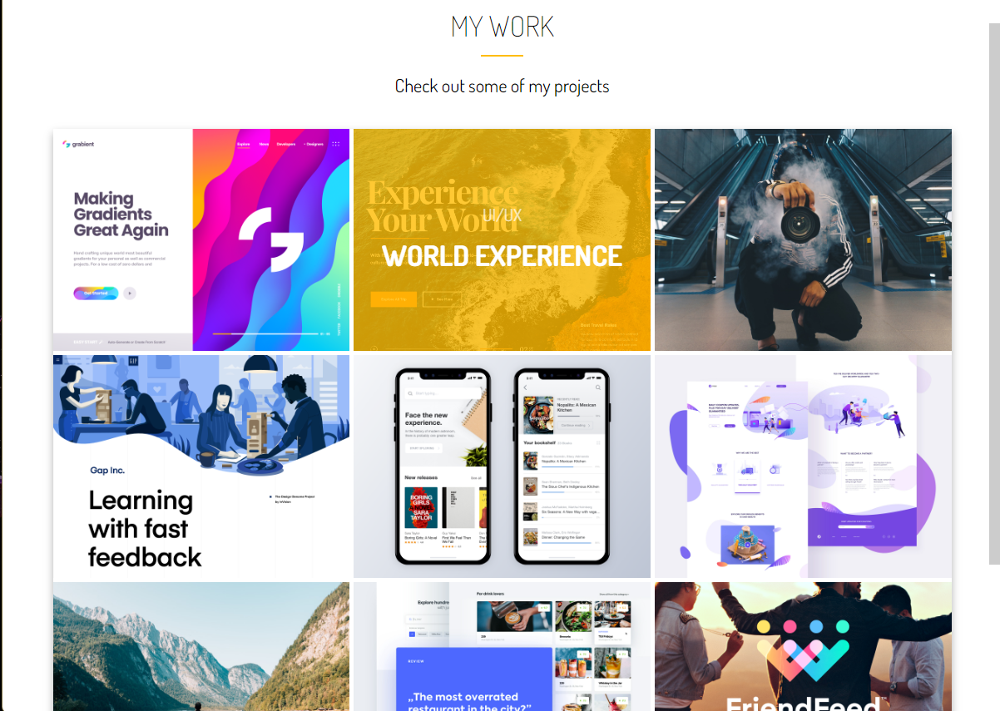
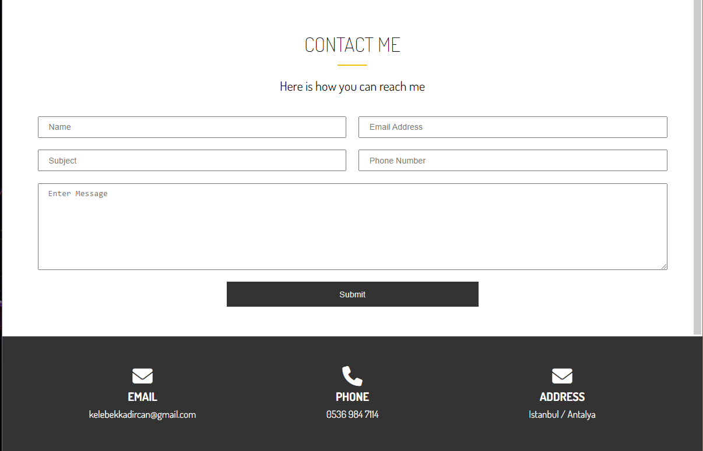

# Personal Portfolio Website

## I have build a responsive website that will display images. links and description. This is my first portfolio project.

 

 

# Files Included

* index.html
* main.css in css folder
* Gruntfile.js
* img folder
* dist folder
* package.json

